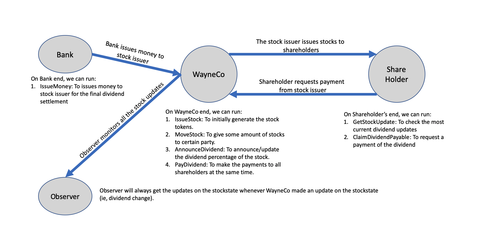

# Stock Pay Dividend Sample

This CorDapp aims to demonstrate the usage of [TokenSDK](https://training.corda.net/libraries/tokens-sdk/), especially the concept of [EvolvableToken](https://training.corda.net/libraries/token-sdk/token-introduction/#evolvabletokentype) which represents stock.
You will find the `StockState` extends from EvolvableToken which allows the stock details(eg. announcing dividends) to be updated without affecting the parties who own the stock.

## Concepts

### Parties

This CordApp assumes there are 4 parties:

* **WayneCo** - creates and maintains the stock state and pays dividends to shareholders after some time passes.
* **Shareholder** - receives dividends base on the owning stock.
* **Bank** - issues fiat tokens.
* **Observer** - monitors all the stocks by keeping a copy of of transactions whenever a stock is created or updated. (In reality, this might be a financial regulatory authority like the SEC.)


Here are the flows that exist between these parties :




This Stock Exchange CorDapp includes:
* A bank issues some money for the final settlement of the dividends.
* A company/stock issuer(WayneCo) issues and moves stocks to shareholders
* The company announces dividends for shareholders to claim before execution day
* Shareholder retrieves the most updated stock information and then claims dividend
* The company distribute dividends to shareholders

### Keys to learn
* Basic usage of TokenSDK
* How the state of stock (ie. EvolvableToken) updates independently without stockholders involved 
* Use of `TokenSelection.generateMove()` and `MoveTokensUtilitiesKt.addMoveTokens()` to generate move of tokens
* Adding observers in token transactions with TokenSDK 

*Note: Some date constraints(e.g. payday) is being commented out to make sure the sample can be run smoothly  

### States
* **[StockState](./contracts/src/main/kotlin/net/corda/samples/stockpaydividend/states/StockState.kt)** -
which holds the underlying information of a stock like stock name, symbol, dividend, etc.  
* **[DividendState](./contracts/src/main/kotlin/net/corda/samples/stockpaydividend/states/DividendState.kt)** -
represents the dividend to be paid off by the company to the shareholder. 

## Pre-Requisites
[Set up for CorDapp development](https://docs.r3.com/en/platform/corda/4.12/community/getting-set-up.html)

## Usage
### Running the nodes


Open a terminal and go to the project root directory and type: (to deploy the nodes using bootstrapper)
```
./gradlew clean deployNodes
```
Then type: (to run the nodes)
```
./build/nodes/runnodes
```

## Interacting with the nodes

When started via the command line, each node will display an interactive shell:

    Welcome to the Corda interactive shell.
    Useful commands include 'help' to see what is available, and 'bye' to shut down the node.

    Tue July 09 11:58:13 GMT 2019>>>

You can use this shell to interact with your node.

##### 1. IssueMoney - Bank
In order to pay off dividends from the company later, the bank issues some fiat tokens to the WayneCo.
This can be executed anytime before step 6. 
>On bank node, execute <br>`start IssueMoney currency: USD, amount: 500000, recipient: WayneCo`

##### 2. IssueStock - Stock Issuer
WayneCo creates a StockState and issues some stock tokens associated to the created StockState.
>On company WayneCo's node, execute <br>`start IssueStock symbol: TEST, name: "Stock, SP500", currency: USD, price: 7.4, issueVol: 500, notary: Notary`

##### 3. MoveStock - Stock Issuer
WayneCo transfers some stock tokens to the Shareholder.
>On company WayneCo's node, execute <br>`start MoveStock symbol: TEST, quantity: 100, recipient: Shareholder`

Now at the Shareholder's terminal, we can see that it received 100 stock tokens:
>On shareholder node, execute <br>`start GetStockBalance symbol: TEST`

##### 4. AnnounceDividend - Stock Issuer
WayneCo announces the dividends that will be paid on the payday.
>On WayneCo's node, execute <br>`start AnnounceDividend symbol: TEST, dividendPercentage: 0.05, executionDate: "2019-11-22T00:00:00Z", payDate: "2019-11-23T00:00:00Z"`

##### 5. ClaimDividendReceivable - Shareholder
Shareholders find the dividend is announced and claims the dividends base on the owning stock. 
>On shareholder node, execute <br>`start ClaimDividendReceivable symbol: TEST`

##### 6. PayDividend - Company
On the payday, the company pay off the stock with fiat currencies.
>On WayneCo node, execute <br>`start PayDividend`

##### 7. Get token balances - Any node
Query the balances of different nodes. This can be executed at anytime.
> Get stock token balances 
<br>`start GetStockBalance symbol: TEST`

>Get fiat token balances
<br>`start GetFiatBalance currencyCode: USD`

#### Test case
You can also find the flow and example data from the test class [FlowTests.kt](workflows/src/test/kotlin/net/corda/samples/stockpaydividend/FlowTests.kt).
 
### Useful links
##### Documentations
[Token-SDK tutorial](https://github.com/corda/token-sdk/blob/master/docs/DvPTutorial.md)
<br>
[Token-SDK design document](https://github.com/corda/token-sdk/blob/95b7bac668c68f3108bca2c50f4f926d147ee763/design/design.md#evolvabletokentype)

##### Other materials
[Blog - House trading sample](https://medium.com/corda/lets-create-some-tokens-5e7f94c39d13) - 
A less complicated sample of TokenSDK about trading house.
<br>
[Blog - Introduction to Token SDK in Corda](https://medium.com/corda/introduction-to-token-sdk-in-corda-9b4dbcf71025) -
Provides basic understanding from the ground up.
<br>
[Sample - TokenSDK with Account](https://github.com/corda/accounts/tree/master/examples/tokens-integration-test)
An basic sample of how account feature can be integrated with TokenSDK

## Bridging To Solana

### Running on Solana Dev Net

Build nodes:

```bash
./gradlew deployNodes
```

Create Solana Accounts and Fund accounts of WayneCo and the BridgingAuthority, create Mint and TokenAccount to be
bridged to:

```bash
./gradlew setupSolanaAccounts
```

Amend `BrigindAuthority` Cordapp's configuration with mappings to newly created accounts:

```bash
./gradlew expandBACordappConfig
```

Run nodes:

```bash
./build/nodes/runnodes
```

### Running with Solana Local Validator

Start a local solana validator with the notary program deployed following instruction from Corda Enterprise.
(the below commands can be run in one go from `./addCordaNetwork.sh` script).

```bash
Add the new network and Notary key to Solana. This Notary will be used by the Corda nodes.
```bash
ADMIN_CLI="solana-aggregator/admin-cli/build/libs/admin-cli-4.14-SNAPSHOT.jar"
java -jar $ADMIN_CLI create-network -u http://localhost:8899 -v -k solana-aggregator/notary-program/dev-keys/DevAD5S5AFhTTCmrD8Jg58bDhbZabSzth7Bu6rG4HFYo.json
```

The command will output confirmation with network ID `1`:

```
Creating network ...
✓ Corda network creation successful - network ID: 1
```

Add the Notary key to the network:

```bash
> java -jar $ADMIN_CLI authorize --address Dev7chG99tLCAny3PNYmBdyhaKEVcZnSTp3p1mKVb5m5 --network 1 -u http://localhost:8899 -k solana-aggregator/notary-program/dev-keys/DevAD5S5AFhTTCmrD8Jg58bDhbZabSzth7Bu6rG4HFYo.json
```

This command will output:

```
> Authorizing notary Dev7chG99tLCAny3PNYmBdyhaKEVcZnSTp3p1mKVb5m5...
> ✓ Notary authorized successfully: Dev7chG99tLCAny3PNYmBdyhaKEVcZnSTp3p1mKVb5m5
```

You can list the authorized notaries with:

```bash
java -jar $ADMIN_CLI list-notaries -u http://localhost:8899 -v -k solana-aggregator/notary-program/dev-keys/DevAD5S5AFhTTCmrD8Jg58bDhbZabSzth7Bu6rG4HFYo.json
```

```
Network ID: 0
   1. Notary: DevNMdtQW3Q4ybKQvxgwpJj84h5mb7JE218qTpZQnoA3
Network ID: 1
   1. Notary: Dev7chG99tLCAny3PNYmBdyhaKEVcZnSTp3p1mKVb5m5
```

Follow the steps from Running on Solana Dev Net.
The only change is to replace Solana Dev Net url with local validator url `http://localhost:8899` in notary config in
`depolyNodes` task. .

#### Using the Cordapps

You can check the current balance on Solana Account:

```bash
spl-token balance --address $TOKEN_ACCOUNT
spl-token display $TOKEN_ACCOUNT
```

##### On WayneCo node console:

Issue Stock `TEST` with liniearID `6116560b-c78e-4e13-871d-d666a5d032a3` matching configuration in Bridging Authority.

```bash
start CreateAndIssueStock \
symbol: TEST, \
name: "Test Stock", \
currency: USD, \
price: 7.4, \
issueVol: 2000, \
notary: "O=Notary Service,L=Zurich,C=CH", \
linearId: 6116560b-c78e-4e13-871d-d666a5d032a3
```

Move 1000 stock tokens to self to Bridging Authority:

```bash
start MoveStock symbol: TEST, quantity: 1000, recipient: "O=Bridging Authority,L=New York,C=US"
```

##### On BridgingAuthority node console:

This is currently a manual step to showcase how bridging, normally the bridging flow starts automatically as soon as
a participant moves token(s) to the Bridging Authority:

```bash
start GetTokenToBridgeFormatted symbol: TEST
```

```bash
start BridgeTokenRpc tokenRef: { txhash: <TX_HASH>, index: 0 } , bridgeAuthority: "O=Bridging Authority,L=New York,C=US"
```

You can check the current balance on Solana Account has increased:

```bash
spl-token balance --address $TOKEN_ACCOUNT
spl-token display $TOKEN_ACCOUNT
```